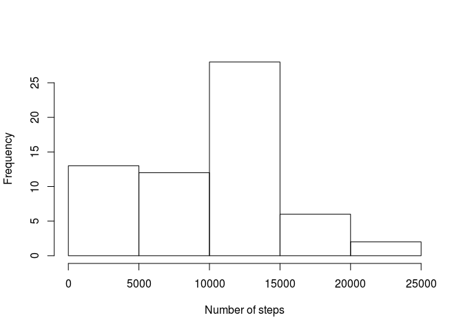
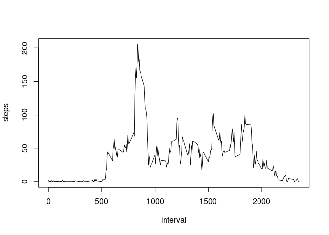
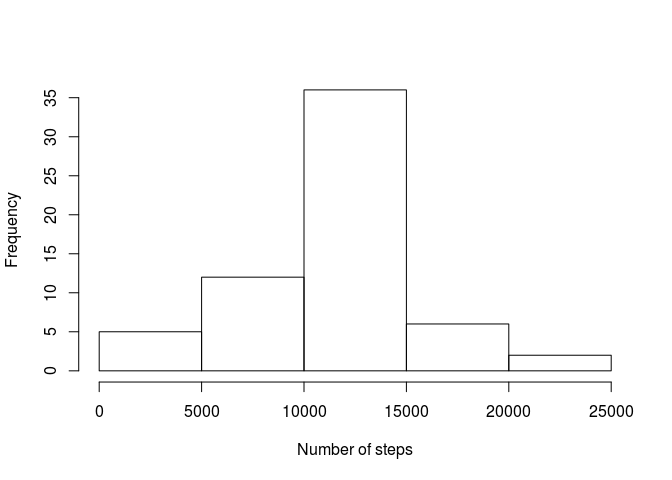
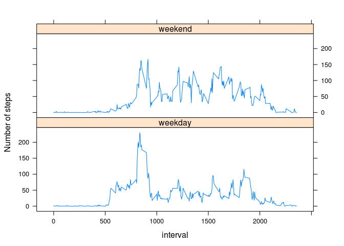

# Reproducible Research: Peer Assessment 1


## Loading and preprocessing the data

First we need to unzip and load the data to a data frame.


```r
unzip("activity.zip")
df <- read.csv("activity.csv")
```

There is no need to format it for this analysis.

## What is mean total number of steps taken per day?

This is the histogram of the total number of steps taken each day.


```r
steps_per_day <- aggregate(df$steps, list(df$date), sum, na.rm = T)
names(steps_per_day) <- c("day", "steps")
hist(steps_per_day$steps, xlab = "Number of steps", main = NA)
```

 

We calculate the mean and the median of the number of steps.


```r
mean_steps <- mean(steps_per_day$steps, na.rm = T)
median_steps <- median(steps_per_day$steps, na.rm = T)
```

The mean of the total number of steps taken per day is **9354.23** steps and the median is **10395** steps.

## What is the average daily activity pattern?

This plot shows the user's average daily activity pattern.


```r
avg_steps_by_interval <- aggregate(df$steps, list(df$interval), mean, na.rm = T)
names(avg_steps_by_interval) <- c("interval", "steps")
plot(steps ~ interval, avg_steps_by_interval, type = "l")
```

 

We calculate in which 5-minute interval of the day the most steps are taken on average.


```r
max_steps_interval <- avg_steps_by_interval[avg_steps_by_interval$steps == max(avg_steps_by_interval$steps), "interval"]
```

The 5-minute interval that contains on average the maximum number of steps is **835**.

## Imputing missing values

In order to calculate the total number of missing values in the dataset we use R's `summary()` function.


```r
summary(df)
```

```
##      steps                date          interval     
##  Min.   :  0.00   2012-10-01:  288   Min.   :   0.0  
##  1st Qu.:  0.00   2012-10-02:  288   1st Qu.: 588.8  
##  Median :  0.00   2012-10-03:  288   Median :1177.5  
##  Mean   : 37.38   2012-10-04:  288   Mean   :1177.5  
##  3rd Qu.: 12.00   2012-10-05:  288   3rd Qu.:1766.2  
##  Max.   :806.00   2012-10-06:  288   Max.   :2355.0  
##  NA's   :2304     (Other)   :15840
```

As we can see above, the total number of missing values is **2304**.

Let's create a new data frame `dff` equal to the original `df` and fill all of it's missing values using the mean for that interval.


```r
dff <- df
dff[is.na(df$steps), "steps"] <- do.call("rbind", replicate(61, avg_steps_by_interval, simplify = FALSE))[is.na(df$steps), "steps"]
```

This is the histogram of the total number of steps taken each day, considering the values just filled.


```r
steps_per_day_filled <- aggregate(dff$steps, list(dff$date), sum)
names(steps_per_day_filled) <- c("day", "steps")
hist(steps_per_day_filled$steps, xlab = "Number of steps", main = NA)
```

 

We calculate the mean and the median of the number of steps on this new data frame.


```r
mean_steps_filled <- mean(steps_per_day_filled$steps)
median_steps_filled <- median(steps_per_day_filled$steps)
```

The mean of the total number of steps taken per day is **10766.19** steps and the median is **10766.19** steps.

These number differ from the estimates from the first part of the assignment. After inputing missing data, the estimates of the total daily number of steps increased.

## Are there differences in activity patterns between weekdays and weekends?

Create a new factor variable `day` in the dataset `dff` with two levels – “weekday” and “weekend” indicating whether a given date is a weekday or weekend day.


```r
Sys.setlocale("LC_TIME", "C")
dff$day <- sapply(weekdays(as.Date(dff$date)), function(day) {
  if (day == "Sunday" | day == "Saturday") return("weekend")
  else return("weekday")
})
dff$day <- as.factor(dff$day)
```

Make a panel plot containing a time series plot (i.e. `type = "l"`) of the 5-minute interval (x-axis) and the average number of steps taken, averaged across all weekday days or weekend days (y-axis).


```r
avg_steps_by_interval_filled <- aggregate(dff$steps, list(dff$interval, dff$day), mean)
names(avg_steps_by_interval_filled) <- c("interval", "day", "steps")
library(lattice)
xyplot(steps ~ interval | day, avg_steps_by_interval_filled, type = "l", layout = c(1, 2), ylab = "Number of steps")
```

 
